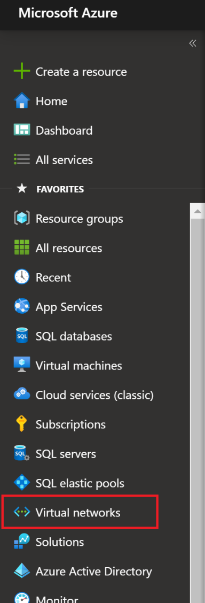
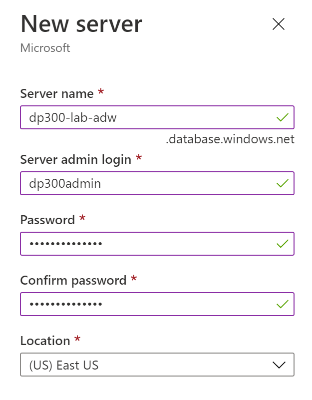
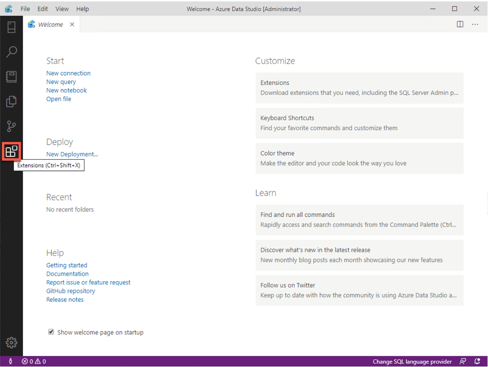
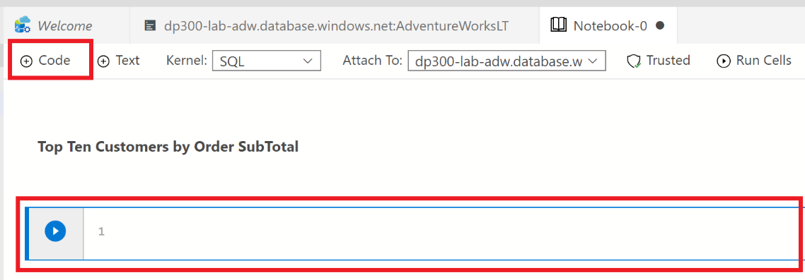
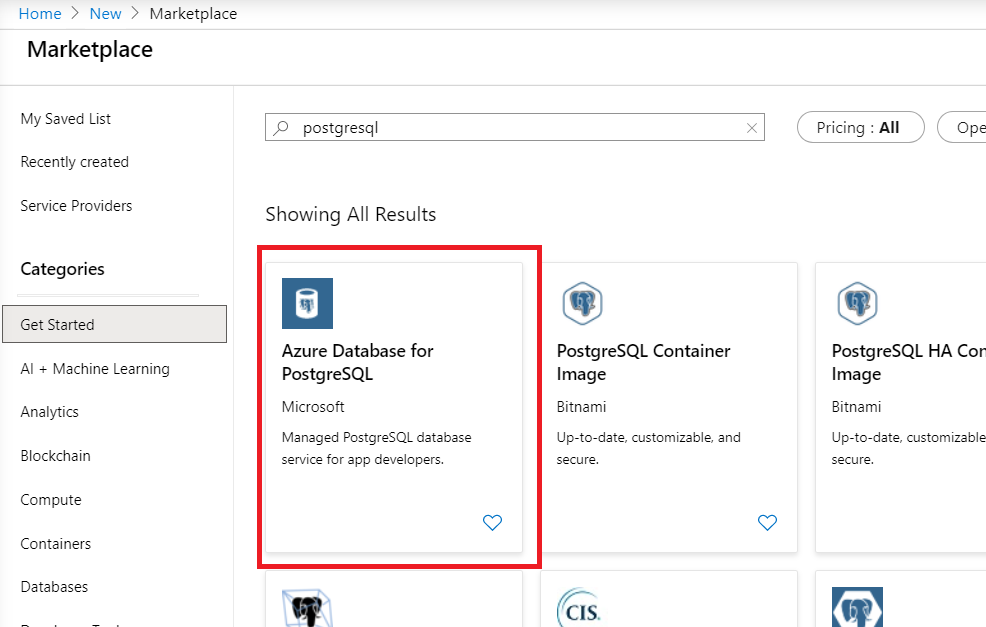
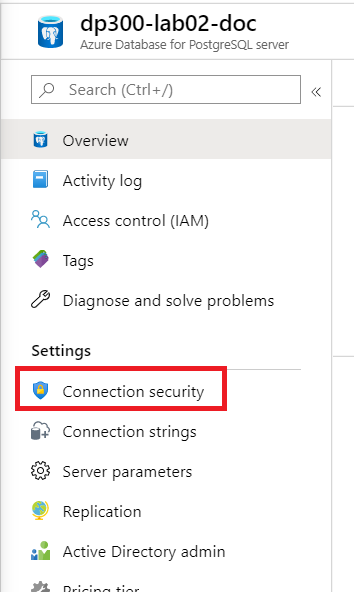
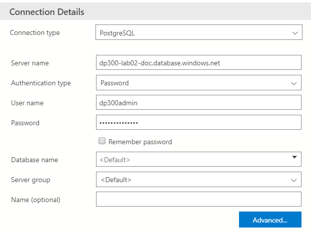

---
lab:
    title: '랩 2 – Azure SQL Database 배포'
    module: '데이터 플랫폼 리소스 계획 및 구현'
---

# 랩 2 – Azure SQL Database 배포

**예상 완료 시간:** 35~40분

**필수 구성 요소:** 없음

**랩 파일:** 없음

# 랩 개요

학생들은 가상 네트워크 엔드포인트를 사용하여 Azure SQL Database를 배포하는 데 필요한 기본 리소스를 구성합니다. SQL Database에 대한 연결은 랩 VM의 Azure Data Studio를 사용하여 유효성을 검사합니다. 마지막으로 Azure Database for PostgreSQL이 만들어집니다.

# 랩 목표

학생들은 다음을 수행합니다:

1. 기본 리소스 구성

2. Azure SQL Database 배포 

3. Azure Data Studio를 사용하여 Azure SQL Database에 연결

4. Azure Database for PostgreSQL 배포

# 시나리오

AdventureWorks의 데이터베이스 관리자로서 배포 보안을 늘리고 단순화하기 위해 가상 네트워크 엔드포인트를 포함하는 새 SQL Database를 설정합니다. Azure Data Studio는 데이터 쿼리 및 결과 보존을 위해 SQL Notebook의 사용을 평가하는 데 사용됩니다.

마지막으로 Azure Database for PostgreSQL가 배포되어 추가 데이터 시스템 요구 사항을 지원합니다.

# 연습 1: 기본 리소스 구성

## 작업 1: 리소스 그룹 만들기

1. 브라우저를 시작하고 [http://portal.azure.com](http://portal.azure.com/)에서 Azure Portal을 연 후 적절한 자격 증명으로 로그인합니다.

2. 홈 화면에서 **리소스 그룹** 단추를 클릭합니다.  
​
	

3. 기존 리소스 그룹을 검토한 다음 **추가** 버튼을 클릭하여 새 리소스 그룹을 만듭니다.  
​
	

4. RG를 만드는 데 필요한 정보로 리소스 그룹 만들기 마법사를 완료합니다.

	- 구독이 원하는 구독으로 설정되어 있는지 확인합니다.

	- 리소스 그룹 이름으로 **DP-300-Lab02**를 입력합니다.

	- 이 랩의 목적을 위해, 실제 위치와 가장 가까운 지역을 선택합니다.

	- **검토 + 만들기** 단추를 클릭합니다.  
​
	

	- **만들기** 단추를 클릭합니다.

## 작업 2: 가상 네트워크 만들기

1. 탐색 창에서 **가상 네트워크**를 클릭합니다.  
​
	랩

2. 다음 정보를 이용해 기본 페이지를 작성합니다.

	- 구독: **랩 구독을 선택합니다.**

	- 리소스 그룹: **DP-300-Lab02** 리소스 그룹을 선택합니다.

	- 이름: **Lab02-vnet**

	- 지역: 리소스 그룹이 만들어졌을 때 동일한 지역을 선택합니다(해당 위치와 가장 가까운 지역).  
​
	

	- **다음: IP 주소** 단추를 클릭합니다.  
​
	

3. 네트워크의 IP 범위를 구성하고 Azure SQL 데이터베이스 엔드포인트에 대해 준비합니다.

	- IP 주소 페이지에서 IPv4 주소 공간에 대한 기본값을 그대로 유지합니다.

	- **기본** 서브넷을 클릭합니다.  
​
	

	- 오른쪽의 편집 서브넷 플라이아웃에서 서비스 드롭다운을 펼치고 **Microsoft.Sql**을 선택합니다.  
​
	

	- **저장**을 클릭합니다.

	- **검토 + 만들기** 단추를 클릭하고 새 가상 네트워크에 대한 설정을 검토한 다음 **만들기**를 클릭합니다.

# 연습 2: Azure SQL Database 배포

## 작업 1: Azure SQL Database 배포

1. Azure Portal에서 왼쪽 탐색 모음 상단에 있는 **+ 리소스 만들기**를 클릭합니다.  
​
	

2. 상단의 검색 상자에서 "SQL 데이터베이스"를 검색한 다음 옵션 목록에서 **SQL Database**를 클릭합니다.  
​
	

3. **만들기** 단추를 클릭합니다.

4. 다음 입력으로 SQL Database 기본 화면 만들기를 완료한 후 **다음: 네트워킹을 클릭합니다.**

	- 구독: 랩 구독을 선택합니다.

	- 리소스 그룹: **DP-300-Lab02** (연습 1에서 생성된 RG)

	- 데이터베이스 이름: **AdventureWorksLT**
	
	- 서버: **새로 만들기**를 클릭합니다. 새 서버 사이드바에서 다음과 같이 양식을 작성합니다.

		- 서버 이름: **dp300-lab-&lt;your initials (lower case)&gt;** (서버 이름은 전역적으로 고유해야 함).

		- 서버 관리자 로그인: **dp300admin**

		- 암호: **dp300P@ssword!**

		- 암호 확인: **dp300P@ssword!**

		- 위치: 가장 가까운 지역을 선택합니다(연습 1과 동일).

		- 새 서버 사이드바는 아래와 같이 보여야 합니다. **확인**을 클릭합니다.

		


    -  Elastic Pool을 사용하고 싶으십니까? **아니요**

    -  컴퓨팅 + 스토리지: **데이터베이스 구성**을 클릭합니다.

		- 구성 화면에서 **기본, 표준, 프리미엄을 원하십니까?**를 클릭합니다.

		

		- **기본**을 클릭합니다

		- **적용** 단추를 클릭합니다


**참고: 이 서버 이름과 로그인 정보를 기록합니다. 이는 다음 랩에서 사용합니다.**

5. 설정을 검토하고 **다음: 네트워킹을 클릭합니다.**  
​
	

6. 네트워킹 화면의 연결 방법에서 **프라이빗 엔드포인트** 라디오 단추를 클릭합니다.  
​
	

7. 그런 다음 프라이빗 엔드포인트 아래에서 **프라이빗 엔드포인트 추가** 링크를 클릭합니다.  
​
	

8. 다음과 같이 프라이빗 엔드포인트 플라이아웃 만들기를 완료합니다.

	- 구독: 랩 구독이 선택되어 있는지 확인합니다.

	- 리소스 그룹: **DP-300-Lab02**

	- 위치: 이 랩의 이전 부분에 대해 선택한 지역과 동일합니다.

	- 이름: **DP-300-SQL 엔드포인트**

	- 대상 하위 리소스 : **SqlServer**

	- 가상 네트워크: **Lab02-vnet**

	- 서브넷: **기본값(10.x.0.0/24)**

	- 프라이빗 DNS 통합 옵션은 기본값으로 유지할 수 있습니다.

	- 설정을 검토한 후 **확인**을 클릭합니다.  
​
	

9. 네트워킹 페이지에 엔드포인트가 나타나는지 확인한 후 **다음: 추가 설정** 단추를 클릭합니다.  
​
	

10. 추가 설정 페이지에서 다음 옵션을 선택합니다.

	- 기존 데이터를 사용하여 **샘플링**하도록 설정합니다.

	- 고급 데이터 보안이 **나중에**로 설정되어 있는지 확인합니다.  
​
	

11. **검토 + 만들기**를 클릭합니다.

12. 설정을 검토하고 **만들기**를 클릭합니다.

13. 배포가 완료되면 **리소스로 이동** 단추를 클릭합니다.  
​

## 작업 2: 새 SQL 서버에 대한 모든 Azure 서비스 액세스를 활성화합니다.

1. SQL Database 블레이드에서 상단 섹션의 SQL Server 이름에 대한 링크를 클릭합니다.  
​

	

2. SQL Server 개체의 탐색 블레이드의 보안에서 **방화벽 및 가상 네트워크**를 클릭합니다.

	

3. Azure 서비스 및 리소스가 이 서버에 액세스할 수 있도록 허용을 **예**로 설정합니다.  
​

	

4. **저장**을 클릭합니다.

 

# 연습 3: Azure SQL Database에 연결

## 작업 1: Azure Data Studio에서 Azure SQL DB 인스턴스를 등록합니다.

1. 랩 VM에서 ADS(Azure Data Studio)를 실행합니다.

	-  Azure Data Studio의 초기 실행 시 이 팝업이 표시될 수 있습니다. 수신하는 경우 **예**를 클릭합니다.  


2. Azure Data Studio가 열리면 아래와 같이 왼쪽 메뉴의 확장 단추를 클릭합니다.

 
	

 

3. 확장자 검색 상자에 Postgres를 입력합니다. Microsoft PostgreSQL 확장자가 표시됩니다. 아래 강조 표시된 설치 단추를 클릭합니다.

	

 

4. ADS의 왼쪽 사이드바에서 **연결** 단추를 클릭한 다음 **연결 추가** 단추를 클릭합니다.
	
	

5. 연결 사이드바에서 연결 세부 정보 섹션을 연결 정보와 함께 작성하여 이전 연습에서 만든 SQL Database에 연결합니다.

	- 연결 형식: **Microsoft SQL Server**

	- 서버: 연습 2, 작업 1에서 만든 SQL Server의 이름을 입력합니다. 예를 들면 다음과 같습니다. **dp300-lab-xx.database.windows.net**  
	['xx' 대신 이니셜이 있는 서버 이름을 만들어 달라는 요청을 받았습니다.]

	- 인증 형식: **SQL 로그인**

	- 사용자 이름: **dp300admin**

	- 암호: **dp300P@ssword!**

	- 데이터베이스 드롭다운을 펼쳐 **AdventureWorksLT**를 선택합니다. 이 서버에 클라이언트 IP를 추가하기 위해 방화벽 규칙을 추가하라는 메시지가 표시되면 계정 추가를 클릭하고 Azure 계정에 로그인합니다. 새 방화벽 만들기 화면에서 **확인**을 클릭합니다.
		
		
	
	- 서버 그룹은 **&lt;default&gt;**로 유지됩니다.

	- 이름(선택 사항)은 원하는 경우 데이터베이스의 식별 이름으로 채울 수 있습니다.

	- 설정을 검토하고 **연결**을 클릭합니다.  
	​

	

6. ADS는 데이터베이스에 연결하고 DB에 대한 몇 가지 기본 정보와 개체의 일부 목록을 표시합니다.  
​
	

## 작업 2: SQL Notebook을 사용하여 Azure SQL Database를 쿼리합니다.

1. 이 랩의 AdventureWorksLT 데이터베이스에 연결된 Azure Data Studio에서 **새 Notebook** 단추를 클릭합니다.  
​
	

2. **+텍스트** 단추를 클릭하여 Notebook에 새 텍스트 상자를 추가합니다.  
​	
	


**참고:** Notebook 내에서 일반 텍스트를 포함하여 쿼리 또는 결과 집합을 설명할 수 있습니다.


3. **주문 소계별 상위 10위 고객** 텍스트를 입력하고 원하는 경우 굵게 표시합니다.  
​
	

4. **+ 코드** 단추를 클릭하여 Notebook 마지막에 새 셀을 추가하고 쿼리를 넣습니다.  
​
	

5. 다음 SQL 문을 새 셀에 붙여 넣습니다.

```sql
select top 10 cust.[CustomerID], cust.[CompanyName], sum(sohead.[SubTotal]) as OverallOrderSubTotal

  from [SalesLT].[Customer] cust

    inner join [SalesLT].[SalesOrderHeader] sohead

        on sohead.[CustomerID] = cust.[CustomerID]

   group by cust.[CustomerID], cust.[CompanyName]

   order by [OverallOrderSubTotal] desc
   ```

6. 화살표가 있는 파란색 원을 클릭하여 쿼리를 실행합니다. 쿼리를 통해 결과가 셀 내에 포함되는 방법을 기록합니다.

7. **+ 텍스트** 단추를 클릭하여 새 텍스트 셀을 추가합니다.

8. **상위 10개의 주문 제품 카테고리** 텍스트를 입력하고 원하는 경우 굵게 표시합니다.

9. **+ 코드** 단추를 다시 클릭하여 새 셀을 추가하고 다음 SQL 문을 셀에 붙여넣습니다.

```sql
select top 10 cat.[Name] as ProductCategory, sum(detail.[OrderQty]) as OrderedQuantity

	from salesLT.[ProductCategory] cat

	   inner join saleslt.[Product] prod
      
	      on prod.[ProductCategoryID] = cat.[ProductCategoryID]

	   inner join salesLT.[SalesOrderDetail] detail

	      on detail.[ProductID] = prod.[ProductID]

	group by cat.[name]

	order by [OrderedQuantity] desc
```
10.  화살표가 있는 파란색 원을 클릭하여 쿼리를 실행합니다. 

11. Notebook의 모든 셀을 실행하고 결과를 표시하려면 도구 모음에서 **셀 실행** 단추를 클릭합니다.  
​
	

12. Azure Data Studio 내에서 파일 메뉴의 Notebook을 D:\Labfiles\Deploy Azure SQL Database(이 폴더는 VM에 이미 있음) 디렉터리에 저장합니다. Azure Data Studio 내부에서 Notebook 탭을 닫습니다. 파일 메뉴에서 Notebook 열기를 선택하고 방금 저장한 Notebook을 엽니다. Notebook에 있는 쿼리와 함께 쿼리 결과가 저장되었는지 관찰합니다.

# 연습 4: Azure Database for PostgreSQL 데이터베이스 배포

## 작업 1: PostgreSQL 데이터베이스 배포

1. Azure Portal에서 왼쪽 탐색 모음 상단에 있는 **+ 리소스 만들기**를 클릭합니다.

	

2. 상단의 검색 상자에서 "postgresql"을 검색한 다음 결과에서 **Azure Database for PostgreSQL**을 클릭합니다.  
​
	

3. **만들기** 단추를 클릭합니다.

4. 단일 서버 옵션에 대해 **만들기**를 클릭합니다.  
​
	

5. 다음 입력으로 단일 서버 기본 화면을 완료합니다.

	- 구독: 랩 구독을 선택합니다.

	- 리소스 그룹: **DP-300-Lab02** (연습 1에서 생성된 RG)

	- 서버 이름: **dp300-lab02-** **&lt;your initials&gt;** (서버 이름은 고유해야 함).

	- 데이터 원본: **없음**

	- 위치: 이 랩에서 사용했던 가장 가까운 지역을 선택합니다.

	- 버전: **10** 또는 **11**

	- 컴퓨팅 + 스토리지 아래에서 **서버 구성** 링크를 클릭합니다.

		- **기본** 탭을 클릭합니다.

		- vCore 슬라이더를 왼쪽으로 끝까지 밀고 **1 vCore**를 선택합니다.  
​
	

		- **확인**을 클릭합니다.

	- 관리자 사용자 이름: **dp300admin**

	- 암호: **dp300P@ssword!**

	- 암호 확인: **dp300P@ssword!**  
	

6. **검토 + 만들기**를 클릭합니다.

7. 설정을 검토하고 **만들기**를 클릭합니다.

8. 배포가 완료되면 **리소스로 이동**을 클릭합니다.

## 작업 2: PostgreSQL 데이터베이스에 대한 모든 Azure 서비스 액세스 사용

1. 데이터베이스의 사이드바에서 설정 아래의 **연결 보안** 단추를 클릭합니다.  
​
	

2. Azure 서비스에 대한 액세스 허용을 **예**로 밉니다.  
​
	

3. 왼쪽 상단에서 **저장**을 클릭합니다.

## 작업 3: Azure Data Studio를 사용하여 PostgreSQL 데이터베이스에 연결

**참고:** PostgreSQL 확장이 ADS에 설치되면 PostgreSQL을 쿼리할 수 있습니다. 이 확장은 랩 VM에 사전 설치됩니다.


1. 랩 VM의 Azure Data Studio에서 연결 사이드바가 확장되었는지 확인하고, 그렇지 않은 경우 왼쪽 탐색 모음의 **연결** 단추를 클릭합니다.

2. **새 연결** 단추를 클릭합니다.  
​
	

3. 연결 세부 정보 사이드바에서 다음 정보를 입력하여 이전 작업의 PostgreSQL 데이터베이스에 연결합니다.

	- 연결 형식: **PostgreSQL**

	- 서버: 작업 1에서 만든 PostgreSQL Server의 이름을 입력합니다. 예를 들면 다음과 같습니다. **dp300-lab02-doc.database.windows.net** (포털의 개요 창에서 서버의 전체 이름을 찾을 수 있음).

	- 인증 형식: **암호**

	- 사용자 이름: **dp300admin@dp300-lab02-doc** (사용자 이름에 호스트 이름이 포함되어야 함). 

	- 암호: **dp300P@ssword!**

	- 데이터베이스 이름은 **&lt;default&gt;**로 유지합니다.

	- 서버 그룹은 **&lt;default&gt;**로 유지됩니다.

	- 이름(선택 사항)은 원하는 경우 데이터베이스의 식별 이름으로 채울 수 있습니다.

4. 설정 검토  
​
	

5. **연결**을 클릭합니다.

6. PostgreSQL 데이터베이스에 대한 ADS의 연결을 기록합니다.  
​
	

 

 
