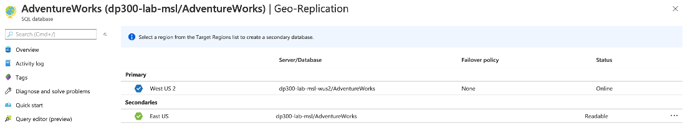
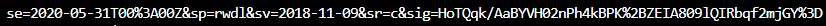

---
lab:
    title: '랩 7 – 고가용성 및 재해 복구 환경 계획 및 구현'
    module: '고가용성 및 재해 복구 환경 계획 및 구현'
---

# Lab 7 – 고가용성 및 재해 복구 환경 계획 및 구현

**예상 시간**: 60~90분

**필수 구성 요소**: 연습 2에서 사용하는 Azure SQL Database는 모듈 3의 랩에서 만들었습니다. 

**랩 파일**: 이 랩에 대한 파일은 D:\Labfiles\High Availability 폴더에 있습니다.

# 랩 개요

학생은 Azure SQL Database를 지역 중복되게 하고 Azure를 사용하는 URL로 백업 및 복원하는 두 가지 주요 작업을 실행합니다. 

# 랩 목표

이 랩을 완료하면 다음을 수행할 수 있습니다:

1. Azure SQL 데이터베이스에 대한 지역에서 복제 사용

	- 지역에서 복제 구성

	- 지역 간 장애 조치 수행

2. URL을 사용하여 SQL Server 데이터베이스를 백업하고 복원합니다.

	- SAS(공유 액세스 서명) 만들기

	- URL에 백업 구성

	- URL에 데이터베이스 백업

	- URL에서 데이터베이스 복원

# 시나리오

이전 랩에서 일상 작업을 자동화했기 때문에 이제 수석 데이터 엔지니어로서 데이터베이스 환경에 대한 IaaS 및 PaaS 구성의 가용성을 개선하는 임무를 맡고 있습니다. 다음과 같은 목표를 달성해야 합니다.

1. Azure SQL Database용 지역에서 복제를 사용하여 데이터베이스에 대한 가용성을 높일 수 있습니다.

2. 데이터베이스를 Azure의 URL로 백업하고 인적 오류 발생 후 복원합니다.


# 연습 2: Azure SQL Database에 대한 지역에서 복제 사용

개요

학생은 모듈 3에 대한 랩에서 만든 Azure SQL Database의 구성을 변경하여 가용성을 개선합니다.

랩 목표

학생들은 다음을 수행할 수 있습니다. 

- 포털을 사용하여 Azure SQL DB에 대한 지역에서 복제 사용

- 장애 조치 등 지역에서 복제 테스트

시나리오

WideWorldImporters 내의 DBA는 Azure SQL Database에 대한 지역에서 복제를 활성화하는 방법을 알고 작동 중인지 확인하고 포털을 사용하여 수동으로 다른 지역으로 장애 조치하는 방법을 알아야 합니다.

필수 요구 사항

- 학생을 위해 만든 Azure 계정 - 로그인(전자 메일) 및 암호를 제공해야 합니다

- 사전에 만든 Azure SQL Database 서버 및 데이터베이스

 

1. 브라우저 창을 통해 Azure Portal에 로그인하지 않은 경우 제공된 Azure 자격 증명을 사용하여 로그인하세요.

2. 메뉴에서 아래와 같이 SQL 데이터베이스를 선택합니다.

	

3. 랩 3에서 만든 Azure SQL Database를 클릭합니다. 아래에 예가 나와 있습니다.

	

 

4. 데이터베이스용 블레이드에서 지역에서 복제를 선택합니다. 

	

	현재 데이터베이스가 구성된 지역은 아래 표에서 흰색 확인 표시가 있는 파란색 육각형에 표시됩니다. 지역에서 복제가 구성되지 않은 것을 볼 수 있습니다.

	

5. 블레이드 하단에서 대상 지역을 선택합니다. 사용 가능한 모든 지역에는 녹색 윤곽선이 있는 육각형이 있습니다.

	

6. 이 예시에서는 미국 서부 2가 보조 블레이드 만들기에서 확인할 수 있게 선택되었습니다. 대상 서버를 선택합니다.

	

7. 새 서버 블레이드에 module7geo<unqiueguid> 이름과 유효한 관리자 로그인 및 보안 암호를 입력합니다. 완료되면 선택을 클릭합니다.

	

8. 보조 블레이드 만들기에서 **확인**을 클릭합니다. 이제 보조 서버와 데이터베이스가 만들어집니다. 상태를 확인하려면 포털 상단의 벨 아이콘 아래를 봅니다. 성공하면 진행 중인 배포에서 배포 성공으로 진행됩니다. 

	


	또한 테이블의 상태 열에서 상태가 초기화 중에서 아래와 같이 시딩 백분율 완료로, 복제가 동기화될 때 읽기 가능으로 이동한다는 것을 알 수 있습니다.

	

9. Azure SQL Database가 지역에서 복제로 구성되었으므로 장애 조치를 수행합니다. 보조 서버를 선택합니다(이전 그림에서는 미국 서부 2이지만 다른 지역을 선택했을 수 있습니다).

10. 블레이드에서 강제 장애 조치를 클릭합니다.

	

11. 메시지가 표시되면 예를 선택합니다. 

	


	기본 복제본의 상태는 보류 중 및 보조(장애 조치)로 전환됩니다. 이 프로세스는 몇 분 밖에 걸리지 않습니다. 완료되면 보조 역할이 새 기본 역할이 되고 이전 기본 역할이 보조 역할로 전환됩니다.

	


# 연습 3: URL에 백업 및 URL에서 복원

예상 시간: 15~30분

이 연습의 주요 작업은 다음과 같습니다.

1. URL에 백업 구성

2. WideWorldImporters 백업

3. WideWorldImporters 복원

## 작업 1: URL로 백업 구성

SQL Server에서 Azure에 데이터베이스를 백업하기 전에 몇 가지 구성 작업을 수행해야 합니다.

1. LON-SQL1 원격 데스크톱 세션으로 전환합니다.

2. Edge를 시작합니다.

3. 아직 하지 않은 경우 제공된 자격 증명을 사용하여 Azure Portal([https://portal.azure.com](https://portal.azure.com/))에 로그인합니다. 

4. 오른쪽 상단 모서리에서 아래 아이콘을 선택하여 Cloud Shell 프롬프트를 엽니다.

	

5. Cloud Shell을 아직 사용하지 않은 경우 포털 하단에 Azure Cloud Shell 사용을 환영하는 메시지가 표시될 수 있습니다. Bash를 선택합니다.

	

6. 이전에 Cloud Shell을 사용하지 않은 경우 스토리지를 제공해야 합니다. 아래 대화 상자에서 스토리지 만들기를 클릭합니다.

	


7. Cloud Shell을 사용한 적이 있는 경우 Cloud Shell 화면의 상위 모서리에 Bash가 표시되어 있는지 확인하십시오. 드롭다운 화살표를 사용하여 PowerShell 또는 Bash 중 하나를 선택할 수 있습니다. 
 

	완료되면 아래와 유사한 프롬프트가 표시됩니다.

	


8. Cloud Shell에서 다음 명령을 실행하여 CLI에서 스토리지 계정을 만듭니다.

	```
	az storage account create -n dp300storage -g DP-300-Lab02 --kind StorageV2 -l eastus2
	```

	스토리지 계정 이름은 고유해야 하며 특수 문자가 없이 모두 소문자여야 합니다. 위의 dp300storage를 dp300storagemsl123과 같은 고유한 이름으로 변경해야 합니다. 값 dp300lab06은 리소스 그룹의 이름입니다. 이전 랩에서 만든 것 중에서 하나를 사용해야 합니다.


	그 다음 이후 단계에서 사용할 계정에 대한 계정 키를 얻습니다. Cloud Shell에서 다음 코드를 실행합니다.


	az storage account keys list -g DP-300-Lab02 -n dp300storage


	계정 키는 위의 명령의 결과에 있습니다. 이전 명령에서 사용한 것과 동일한 이름(-n 다음) 및 리소스 그룹(-g 다음)을 사용해야 합니다. 여기에 표시된 대로 key1에 대해 반환된 값을 복사합니다(이중 따옴표 없이).


	
 

9. SQL Server에서 데이터베이스를 URL로 백업할 때는 스토리지 계정과 계정 내 컨테이너가 사용됩니다. 이 단계에서 특별히 백업 스토리지를 위한 컨테이너를 만듭니다. 이를 위해서 다음을 실행하세요.

	```
	az storage container create --name "backups" --account-name "dp300storage" --account-key "storage_key" --fail-on-exist
	```
 
	여기서 dp300storage는 스토리지 계정을 만들 때 사용되는 스토리지 계정 이름이며 storage_key는 위에서 생성된 키입니다. 출력은 true를 반환해야 합니다.

	


10. 컨테이너 백업이 만들어졌는지 추가로 확인하려면 다음을 실행하세요. 

	```
	az storage container list --account-name dp300storage" --account-key "storage_key"
	```

	여기서 sdp300storage는 만들 때 사용한 스토리지 계정이며 storage_key는 위에서 생성한 키입니다. 출력의 일부는 아래와 유사하게 반환해야 합니다.

	


11. 보안을 위해 컨테이너 수준에서 SAS(공유 액세스 서명)이 필요합니다. 이는 Cloud Shell 또는 PowerShell을 통해 수행할 수 있으며, 다음을 실행합니다.

	```
	az storage container generate-sas -n "backups" --account-name "dp300storage" --account-key "storage_key" --permissions "rwdl" --expiry "date_in_the_future" -o tsv
	```
	

	여기서 dp300storage는 위에서 만든 스토리지 계정 이름이고, storage_key는 위에서 생성한 키이고, date_in_the_future는 지금보다 늦은 시간입니다. date_in_the_future는 반드시 UTC여야 합니다. 2020년 5월 31일 자정에 만료된다는 의미의 2020-05-31T00:00Z를 예로 들 수 있습니다. 


	출력은 다음 작업에서 사용될 아래와 비슷한 것을 반환해야 합니다.

	


## 작업 2: WideWorldImporters 백업

이제 기능이 구성되었으므로 백업 파일을 Azure의 Blob으로 생성할 수 있습니다. 

1. SSMS로 전환하고 LON-SQL1에 연결되어 있는지 확인합니다.

2. 새 쿼리를 클릭합니다.

3. 다음 Transact-SQL을 사용하여 클라우드 스토리지에 액세스할 때 사용할 자격 증명을 만듭니다. 적절한 값을 입력합니다.
	```sql
	IF NOT EXISTS 

	(SELECT * FROM sys.credentials 

	WHERE name = 'https://dp300storage.blob.core.windows.net/backups') 

	BEGIN

	CREATE CREDENTIAL [https://dp300storage.blob.core.windows.net/backups]

	WITH IDENTITY = 'SHARED ACCESS SIGNATURE',

	SECRET = 'sas_token'

	END;

	GO 
	```
	dp300storage는 작업 1에서 생성된 스토리지 계정 이름이고 sas_token은 9단계에서 생성된 값입니다. 

4. 실행을 클릭합니다. 이것은 성공해야 합니다.

5. Transact-SQL에서 다음 명령을 사용하여 데이터베이스 WideWorldImporters를 Azure에 백업합니다.
	```sql
	BACKUP DATABASE WideWorldImporters 

	TO URL = 'https://dp300storage.blob.core.windows.net/backups/WideWorldImporters.bak';

	GO 
	```
	dp300storage는 작업 1에서 사용되는 스토리지 계정 이름입니다.

	성공한다면 다음과 비슷한 출력이 표시될 것입니다.

	'WideWorldImporters' 데이터베이스(파일 1의 'WWI_Primary' 파일)에 대해 처리된 1240 페이지.

	'WideWorldImporters' 데이터베이스(파일 1의 'WWI_UserData' 파일)에 대해 처리된 53104 페이지.

	'WideWorldImporters' 데이터베이스(파일 1의 'WWI_InMemory_Data_1' 파일)에 대해 처리된 3865 페이지.

	'WideWorldImporters' 데이터베이스(파일 1의 'WWI_Log' 파일)에 대해 처리된 1468 페이지.

	BACKUP DATABASE는 59677페이지를 14.839초(31.419MB/초) 만에 성공적으로 처리했습니다.

	완료 시간: 5/18/2020 8:01:41 AM

	

	잘못 구성된 경우 다음과 비슷한 오류 메시지가 표시됩니다.

	Msg 3201, Level 16, State 1, Line 33  
	백업 디바이스 'https://dp300storage.blob.core.windows.net/container_name/WideWorldImporters.bak'를 열 수 없습니다. 운영 체제 오류 50(요청이 지원되지 않습니다).  
	Msg 3013, Level 16, State 1, Line 33  
	BACKUP DATABASE가 비정상적으로 종료됩니다.


	잘못 입력한 것이 없는지 그리고 모든 것이 성공적으로 만들어졌는지 확인합니다.

6. 파일이 실제로 Azure에 있는지 확인하려면 Storage Explorer 또는 Azure Cloud Shell을 사용할 수 있습니다. Bash의 구문은 다음과 같습니다. 
	```
	az storage blob list -c "backups" --account-name "dp300storage" --account-key "storage_key"
	```
	
	dp300storage는 작업 1에서 사용되는 스토리지 계정 이름이고, storage_key는 작업 1에서 사용되는 키입니다. 샘플 출력이 아래에 표시됩니다.

	

 
## 작업 3: WideWorldImporters 복원

이 작업에서는 데이터베이스를 복원하는 방법을 보여 줍니다.


1. 쿼리 창에서 다음을 실행합니다. 
	```sql
	USE WideWorldImporters;

	GO
	```

2. 이제 고객 ID가 1인 고객 테이블의 첫 번째 행을 반환하려면 아래 문을 실행합니다. 고객의 이름을 적어둡니다.
	```sql
	SELECT TOP 1 * FROM Sales.Customers;

	GO

	3. 이 명령을 실행하여 해당 고객의 이름을 변경합니다.

	UPDATE Sales.Customers

	SET CustomerName = 'This is a human error'

	WHERE CustomerID = 1;

	GO
	```

4. 이름이 변경되었는지 확인하기 위해 2단계를 다시 실행합니다. 이제 누군가가 WHERE 절 없이 수천 또는 수백만 개의 행을 변경했거나 잘못된 WHERE 절을 변경했다고 상상해 보세요.

5. 데이터베이스를 복원하여 3단계에서 변경하기 전의 원래 위치로 되돌리려면 다음을 실행합니다.
	```sql
	USE master;
	GO

	RESTORE DATABASE WideWorldImporters 

	FROM URL = 'https://dp300storage.blob.core.windows.net/backups/WideWorldImporters.bak';

	GO
	```

	여기서 sp300storage는 작업 1에서 사용한 스토리지 계정 이름입니다.

	다음과 같은 출력이 표시되어야 합니다.

	'WideWorldImporters' 데이터베이스(파일 1의 'WWI_Primary' 파일)에 대해 처리된 1240 페이지.

	'WideWorldImporters' 데이터베이스(파일 1의 'WWI_UserData' 파일)에 대해 처리된 53104 페이지.

	'WideWorldImporters' 데이터베이스(파일 1의 'WWI_Log' 파일)에 대해 처리된 1468 페이지.

	'WideWorldImporters' 데이터베이스(파일 1의 'WWI_InMemory_Data_1' 파일)에 대해 처리된 3865 페이지.

	RESTORE DATABASE는 59677페이지를 16.167초(28.838MB/초) 만에 성공적으로 처리했습니다.

	완료 시간: 5/18/2020 8:35:06 AM

6. WideWorldImporters의 복원이 완료되면 1단계와 2단계를 다시 실행합니다. 데이터는 원래 있던 곳으로 돌아갑니다.
